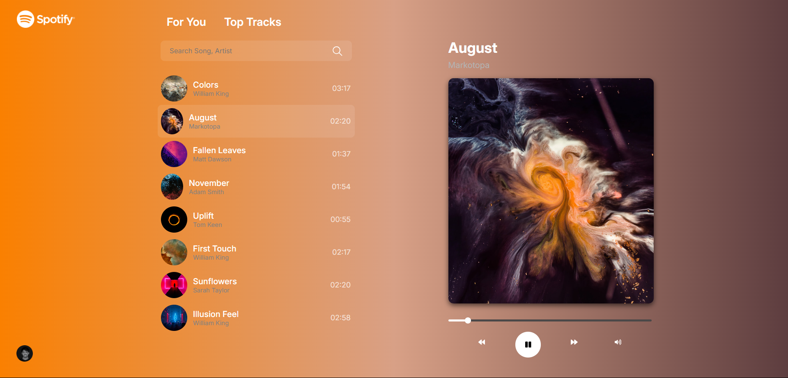

 Here's the refactored README with the images formatted according to the given structure:

# SPOTIFY PROTOTYPE
### A MUSIC Application

An application to play music.

## Demo Link

Visit the [SpotifyPrototype Demo](https://spotify-prototype.vercel.app/) to see the application in action.

## Basic Outline

- [x] Search for various music.
- [x] play previous music
- [x] play forward
- [x]  can pause

## Technology Used

- [x] React
- [x] Redux Toolkit and React Redux (for state management)
- [x] CSS

## Steps to Launch the Code and Demo

1. Clone the repository.
2. Run `npm install` to install all dependencies.
3. Run `npm start` to start the application.
4. Open your browser and go to `http://localhost:3000/` to view the application.

## Screenshots

### Mobile View

| Mobile View 1 | Mobile View 2 | Mobile View 3 |
| :------------:| :------------:| :------------:| 
|  |  |  | 
---

### Tablet View

| Tablet View 1 | Tablet View 2 | Tablet View 3 |
| :------------:| :------------:| :------------:|
|  |  |  |
---

### Desktop View

| Desktop View 1 | Desktop View 2 | Desktop View 3 |
| :-------------:| :-------------:| :-------------:| 
|  |  |  |
| Desktop View 4 | Desktop View 5 | Desktop View 6 |
|  |
---

This is an overview of SpotifyPrototype - 'A music Exploration Application', detailing its features, technologies used, how to launch the application, and screenshots showcasing its mobile, tablet, and desktop views.